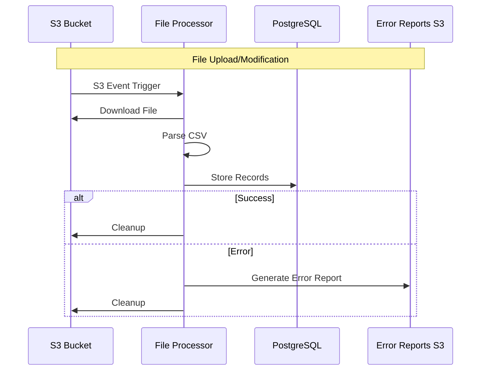

# S3 File Processor with PostgreSQL Integration

A Java-based application that monitors an S3 bucket for file uploads and modifications, processes CSV files, and stores the data in PostgreSQL. The system includes comprehensive error reporting and monitoring capabilities.

## Architecture

The system consists of the following components:

1. **S3 Event Monitoring**: Listens for file uploads and modifications in the configured S3 bucket
2. **File Processing**: Downloads and processes CSV files from S3
3. **Database Integration**: Stores processed data in PostgreSQL with proper indexing
4. **Error Reporting**: Generates detailed error reports and stores them in S3

### Sequence Diagram



## Features

### File Processing
- Monitors S3 bucket for file uploads and modifications
- Processes CSV files with header validation
- Supports batch processing for better performance
- Handles both new files and updates

### Database Operations
- Efficient batch processing with configurable batch size
- Automatic timestamp management (created_at, updated_at)
- Optimized indexes for better query performance
- Connection pooling with HikariCP

### Error Reporting
- Detailed error reports in JSON format
- Automatic error report generation and S3 upload
- Context-specific error information
- Configurable error report retention
- Error tracking across different processing stages:
  - File download errors
  - CSV parsing errors
  - Database operation errors
  - General processing errors

## Configuration

### Environment Variables
```bash
S3_BUCKET_NAME=your-bucket-name
FILE_KEY=path/to/file.csv
AWS_REGION=us-east-1
EVENT_TYPE=ObjectCreated:Put
ERROR_REPORTS_PREFIX=error-reports
```

### Application Properties
```properties
# Database Configuration
db.url=jdbc:postgresql://localhost:5432/csv_processor
db.username=postgres
db.password=postgres
db.pool.size=10

# AWS Configuration
aws.region=us-east-1
aws.s3.bucket.name=your-bucket-name

# Error Reporting
app.error.reports.prefix=error-reports
app.error.reports.retention.days=30
app.error.reports.max.size.mb=10
```

## Error Report Structure

Error reports are stored in JSON format with the following structure:

```json
{
  "timestamp": "2024-03-21T10:30:45",
  "fileKey": "example.csv",
  "eventType": "ObjectCreated:Put",
  "errorType": "java.sql.SQLException",
  "errorMessage": "Database connection failed",
  "stackTrace": "...",
  "additionalInfo": {
    "processingType": "newFile",
    "recordId": "123",
    "bucketName": "my-bucket",
    "region": "us-east-1"
  }
}
```

## Building and Running

1. Build the project:
```bash
./gradlew build
```

2. Run the application:
```bash
./gradlew run
```

## Error Handling

The system implements comprehensive error handling at multiple levels:

1. **File Processing Errors**
   - S3 download failures
   - File format issues
   - CSV parsing errors

2. **Database Errors**
   - Connection failures
   - Constraint violations
   - Transaction errors

3. **Error Report Management**
   - Automatic report generation
   - S3 upload with metadata
   - Configurable retention period
   - Size limits for reports

## Troubleshooting

### Common Issues

1. **Database Connection Issues**
   - Check database credentials and connection string
   - Verify network connectivity
   - Check connection pool settings

2. **S3 Access Issues**
   - Verify AWS credentials
   - Check bucket permissions
   - Validate region configuration

3. **Error Report Issues**
   - Check S3 bucket permissions for error reports
   - Verify error report prefix configuration
   - Monitor error report size limits

### Error Report Location

Error reports are stored in the configured S3 bucket under the specified prefix:
```
s3://<bucket-name>/<error-reports-prefix>/YYYY-MM-DD-HH-mm-ss-error-report.json
```

## Contributing

1. Fork the repository
2. Create a feature branch
3. Commit your changes
4. Push to the branch
5. Create a Pull Request

## License

This project is licensed under the MIT License - see the LICENSE file for details. 