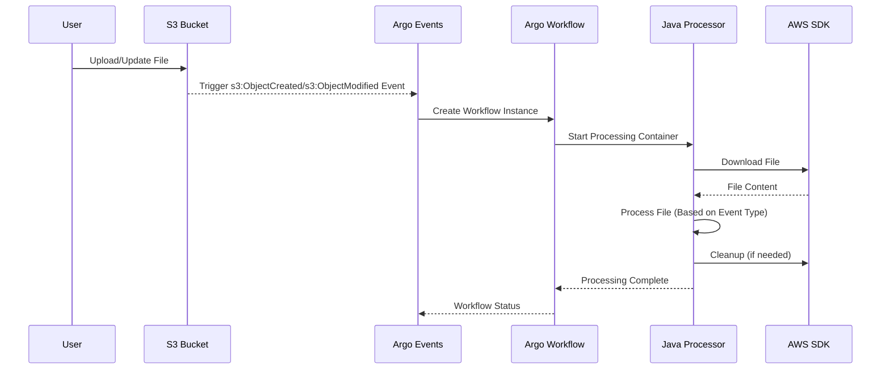

# S3 File Processor with Argo Workflows

This project implements an automated file processing system that monitors an S3 bucket and processes files as they are uploaded or modified. The system uses Argo Workflows and Events to handle the file processing in a scalable and reliable manner.

## Architecture

The system consists of the following components:
- Argo Events: Monitors S3 bucket for new file uploads and modifications
- Argo Workflows: Orchestrates the file processing workflow
- Java Application: Processes the files using AWS SDK

## Sequence Diagram



## Prerequisites

- OpenShift cluster with Argo Workflows and Events installed
- AWS S3 bucket
- AWS credentials with appropriate permissions
- Java 11 or later
- Gradle 7.6.1 or later

## Installation

1. Install Argo Workflows and Events:
```bash
# Install Argo Workflows
kubectl create namespace argo
kubectl apply -n argo -f https://github.com/argoproj/argo-workflows/releases/download/v3.4.8/install.yaml

# Install Argo Events
kubectl create namespace argo-events
kubectl apply -n argo-events -f https://github.com/argoproj/argo-events/releases/download/v1.7.4/install.yaml
```

2. Build the Java application:
```bash
./gradlew build
```

3. Build and push the Docker image:
```bash
docker build -t your-registry/s3-file-processor:latest .
docker push your-registry/s3-file-processor:latest
```

4. Apply the Kubernetes configurations:
```bash
# Apply RBAC first
oc apply -f argo-rbac.yaml

# Apply the Argo configurations
oc apply -f argo-s3-processor.yaml
```

## Configuration

Update the following configurations in `argo-s3-processor.yaml`:

1. S3 Bucket Configuration:
```yaml
spec:
  s3:
    bucket-events:
      bucketName: your-bucket-name
      region: your-aws-region
      events:
        - s3:ObjectCreated:*
        - s3:ObjectModified:*
```

2. Container Resources:
```yaml
resources:
  requests:
    memory: "512Mi"
    cpu: "200m"
  limits:
    memory: "1Gi"
    cpu: "500m"
```

## AWS IAM Permissions

The system requires the following AWS permissions:
```json
{
    "Version": "2012-10-17",
    "Statement": [
        {
            "Effect": "Allow",
            "Action": [
                "s3:GetObject",
                "s3:HeadObject"
            ],
            "Resource": [
                "arn:aws:s3:::your-bucket-name/*"
            ]
        }
    ]
}
```

## Monitoring

1. View Workflow Status:
```bash
argo list
```

2. Check Workflow Logs:
```bash
argo logs @latest
```

3. Monitor in Argo UI:
```bash
kubectl port-forward svc/argo-server -n argo 2746:2746
```
Then visit: http://localhost:2746

## Development

### Project Structure
```
.
├── build.gradle              # Gradle build configuration
├── src/
│   └── main/
│       ├── java/
│       │   └── com/
│       │       └── example/
│       │           └── S3FileProcessor.java
│       └── resources/
│           └── logback.xml   # Logging configuration
├── Dockerfile               # Container build file
├── argo-rbac.yaml          # RBAC configuration
└── argo-s3-processor.yaml  # Argo configuration
```

### Adding Custom Processing Logic

The Java processor handles different types of events:

1. New File Upload:
```java
private static void processNewFile(File file) throws IOException {
    // Add your new file processing logic here
}
```

2. File Update:
```java
private static void processFileUpdate(File file) throws IOException {
    // Add your file update processing logic here
}
```

3. Common Processing:
```java
private static void processFile(File file) throws IOException {
    // Add your common file processing logic here
}
```

## Event Types

The system handles the following S3 event types:
- `s3:ObjectCreated:Put` - New file upload
- `s3:ObjectCreated:CompleteMultipartUpload` - Large file upload completion
- `s3:ObjectModified:Put` - File update
- `s3:ObjectModified:CompleteMultipartUpload` - Large file update completion

## Troubleshooting

1. Check Argo Events logs:
```bash
kubectl logs -n argo-events -l app.kubernetes.io/name=eventsource-controller
```

2. Check Workflow logs:
```bash
argo logs @latest
```

3. Common Issues:
   - AWS credentials not properly configured
   - Insufficient IAM permissions
   - Resource limits too low
   - Network connectivity issues
   - Event type not properly handled

## Contributing

1. Fork the repository
2. Create a feature branch
3. Commit your changes
4. Push to the branch
5. Create a Pull Request

## License

This project is licensed under the MIT License - see the LICENSE file for details. 